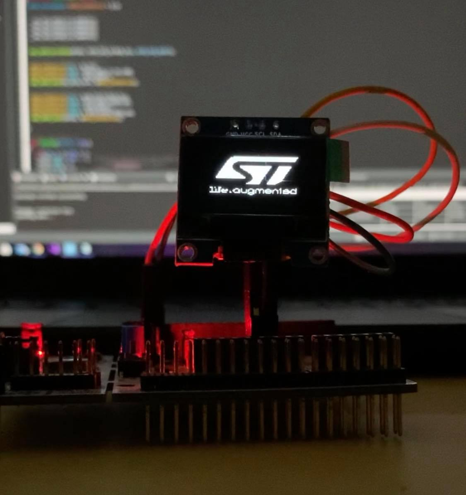
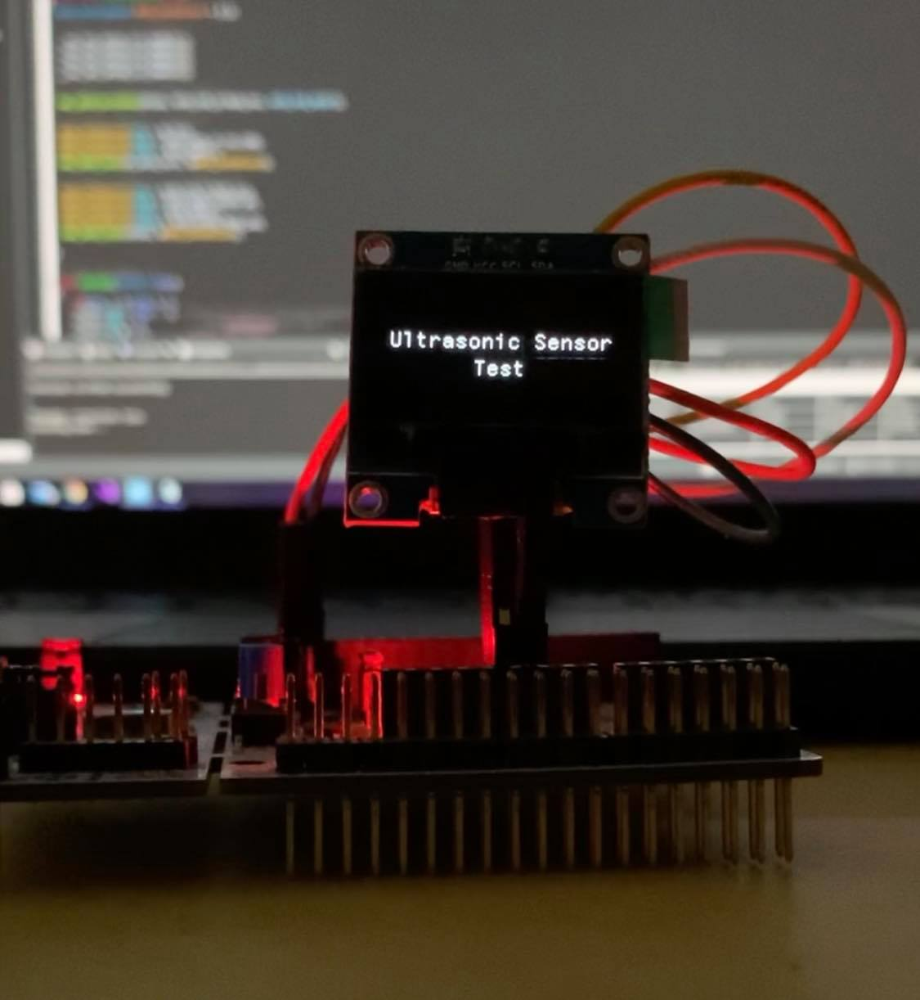

# ssd1306-OLED-Library-for-STM32-MCUs
This Library will enable you to use any  ssd1306 oled with the stm32 microcontrolled family . 
Make sure you include the appropriate .h file for your MCU (example: "stm32f4xx_hal.h") and the appropriate  pointer to the I2C_HandleTypeDef structure (i.e hi2c) .

 
![]im2.jpg) 

